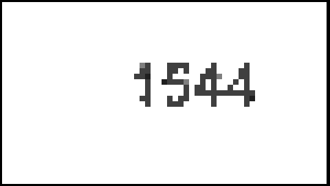
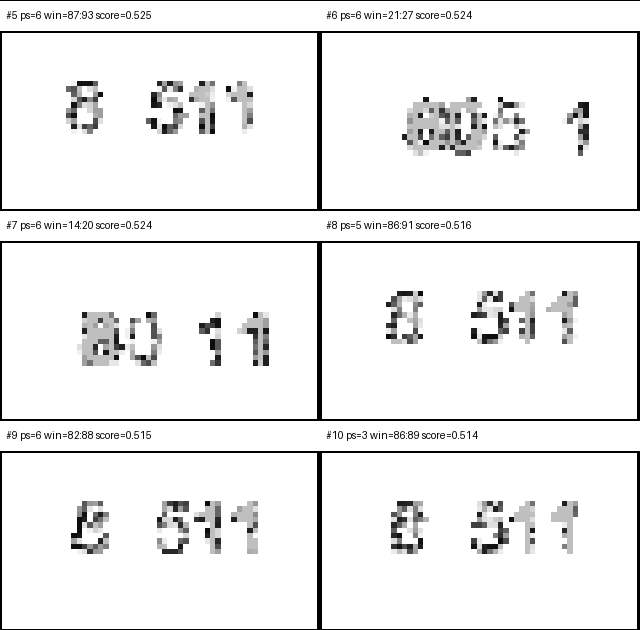
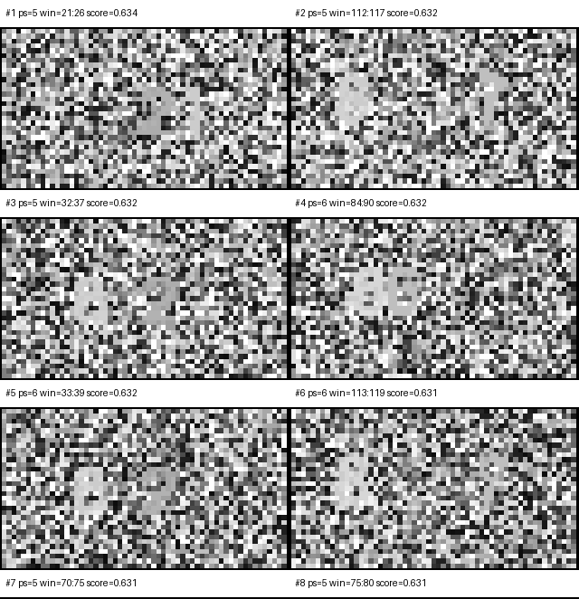

# GOTCHA

**G**liding **O**ptical **T**rick to **C**hallenge **H**umans vs **A**lgorithms

I saw a cool video about a video game noise shader and thought: what if
overlapping random noise masks with orthogonal movement could hide a secret
number, readable only by humans? A single frame looks like pure static. But
when the video plays, your visual system groups the motion and the number pops
out.

<video src="assets/version_1.mp4" controls muted playsinline width="720">
  Your browser does not support embedded video.
</video>

<details>
<summary>Reveal</summary>

**1544**

</details>

I shared it publicly and confidently claimed that biology still has a leg up
on technology. Within hours, someone in the comments cracked it using
block-matching optical flow. I personally dug into this attack vector
and realized that the algorithm only required **two frames** to retrieve
the secret message.



Instead of walking away, I spent the next few weeks trying to make it harder
to break. The second version adds one more digit and 
never shows all digits at once, so no single
frame pair can recover the full secret. But sweeping across all pairs still
lets the bot piece together the whole number.

<video src="assets/version_2.mp4" controls muted playsinline width="720">
  Your browser does not support embedded video.
</video>

<details>
<summary>Reveal</summary>

**80511**

</details>



The third version uses different grain sizes for the text and background.
The mismatch is actually pleasant for a human viewer — the difference in
pixel size makes edges easy to perceive. But individual frames are hard to
OCR even though you can almost see the digits, and the background palette
cycling completely defeats block-flow angle analysis.

<video src="assets/version_3.mp4" controls muted playsinline width="720">
  Your browser does not support embedded video.
</video>

<details>
<summary>Reveal</summary>

**86217**

</details>

The attack recovered nothing — pure noise.



Can it be broken? Absolutely — just not by these algorithms. Single-frame
analysis with OCR would probably be a more effective angle, and I expect
someone will point that out eventually. But I learned a lot, and this repo
tells the story of that process. If you want to take the journey follow
the links.

## Tools

| File | What it does |
|------|-------------|
| `generate_baseline.py` | Original generator — two sliding noise fields. Trivially crackable. |
| `generate_defense.py` | Defense generator — tile-based motion palette with phase-sliced reveals. |
| `attack_bench.py` | Run the block-flow attack on a single video file. |
| `attack_pair_sweep.py` | Sweep consecutive frame pairs across a video and rank the best attacks. |
| `attack_resistance_sweep.py` | Generate a grid of defense settings, attack each, and rank by resistance. Saves videos for the strongest and weakest cases. |

## The Story

1. **[The Idea](docs/01-the-idea.md)** — A noise shader, orthogonal motion,
   and a confident first version.
2. **[Breaking It](docs/02-breaking-it.md)** — Someone cracked it publicly.
   Then I built the attack tools to understand exactly how broken it was.
3. **[Defending It](docs/03-defending.md)** — Shared motion palettes,
   phase-sliced reveals, and randomized scheduling made recovery harder—but
   not impossible.
4. **[What We Learned](docs/04-what-we-learned.md)** — Nothing is bot-proof.
   The interesting part was finding out why.
5. **[Running the Code](docs/05-running-the-code.md)** — Generate your own
   clips, run the attacks, and reproduce the experiments.

## Try It Yourself

```bash
poetry install
```

Generate a clip with the baseline generator (the one that got cracked):

```bash
poetry run python generate_baseline.py --text HELLO --grain 16 --output hello.mp4
```

Now attack it:

```bash
poetry run python attack_bench.py hello.mp4 --output-dir attack_runs/hello
```

Open `attack_runs/hello/block_flow_angle.png` — the word is right there.

If you want the ranked montage workflow that sweeps many frame pairs for one
existing video, use:

```bash
poetry run python attack_pair_sweep.py hello.mp4 --output-dir sweep_runs/hello
```

That writes a ranked CSV/JSON summary plus `top12_montage.png` under
`sweep_runs/hello`.

Try the defense generator instead:

```bash
poetry run python generate_defense.py --random-digits --background-grain 8 --text-grain 16 --output defended.mp4
```

Attack that one and compare the results. Full flag reference in
[Running the Code](docs/05-running-the-code.md).

## Inspiration

This project was directly inspired by
[this YouTube video](https://www.youtube.com/watch?v=RNhiT-SmR1Q).

## License

[MIT](LICENSE)
