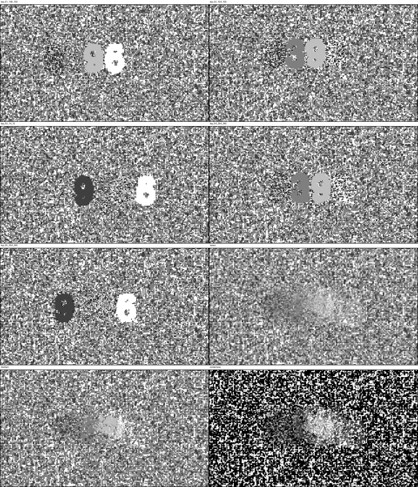

# GOTCHA

**G**liding **O**ptical **T**rick to **C**hallenge **H**umans vs **A**lgorithms

GOTCHA is a small perception demo: a short code or word is hidden inside moving
noise. A single frame looks like nonsense, but over time humans can often read
the message quickly because the visual system is good at grouping motion.

The project now includes:

- a baseline generator, where text and background use different motion fields
- a defense-oriented generator, which tries to keep human readability while
  making automated recovery slower and less direct
- attack tooling for benchmarking reconstruction attempts against generated
  clips

This is a toy experiment, not a serious CAPTCHA product.

## Classic Example

Direct MP4 link: [assets/secret.mp4](assets/secret.mp4)

<video src="https://github.com/user-attachments/assets/094cc537-18a5-4854-b6d2-7a48b80a8a9f" controls muted playsinline width="720">
  Your browser does not support embedded video. Use the direct link above.
</video>

<details>
<summary>Reveal</summary>

**TIMBER**

</details>

## Why It Works

- Each frame is built from noise, not explicit text pixels.
- Humans are good at motion segmentation and temporal completion.
- A screenshot is usually not enough; the message emerges across time.
- Simple image statistics can miss what a human sees immediately.

In the baseline generator, this effect comes from a clean motion partition:
background noise moves one way and the text region moves another way. That is
good for humans, but it is also exactly what a tuned block-flow attack can
exploit.

## Generators

### Baseline Generator

Use the original generator when you want the clearest motion-pop effect:

```bash
poetry run python text_noise_video.py --text TIMBER --output timber.mp4
```

Without Poetry:

```bash
pip install numpy pillow imageio imageio-ffmpeg
python text_noise_video.py --text TIMBER --output timber.mp4
```

See all options with:

```bash
python text_noise_video.py --help
```

Useful baseline flags:

- `--grain` to make the noise coarser or finer
- `--text-drift` and `--text-drift-speed` to move the whole word around
- `--border-width`, `--border-style`, `--border-color` for outlines
- `--font` to use a specific `.ttf` or `.otf` font file

### Defense Generator

The defense variant tries to reduce the clean text-shaped motion partition that
the baseline leaks.

```bash
poetry run python text_noise_video_defense.py --text TIMBER --output timber_defense.mp4
```

To generate a hidden 5-digit code without printing it to stdout:

```bash
poetry run python text_noise_video_defense.py \
  --random-digits \
  --grain 9 \
  --duration 10 \
  --output secret_digits.mp4
```

The defense generator differs from the baseline in three main ways:

- local motion comes from a shared palette across the whole frame
- the text is split into phase-sliced reveal groups instead of one coherent
  motion region
- whole digits can stay intact while the reveal schedule changes which groups
  are visible over time

Useful defense flags:

- `--random-digits` to generate a hidden 5-digit code internally
- `--grain` to control the size of the moving noise chunks
- `--phase-mode` to choose between `components` and `bands`
- `--phase-count`, `--active-phases`, `--phase-hold` to tune how much of the
  text is visible at once
- `--schedule-mode` to choose between the old deterministic cycle and the newer
  randomized reveal schedule
- `--schedule-span` to control how many phase windows a randomized visible
  subset tends to persist
- `--background-cycle-step` and `--background-cycle-hold` to add or disable
  background motion cycling

The current preferred setup keeps whole digits readable and makes the reveal
pattern less predictable, rather than slicing glyphs into smaller fragments.

## Attack Tooling

### Attack Bench

`attack_bench.py` runs reconstruction attacks against a clip and records output
images, timings, and simple image metrics.

Algorithms currently included:

- `mean`
- `stddev`
- `delta_energy`
- `pca1`
- `block_flow_angle`

In practice, only `block_flow_angle` has been a serious recovery path in this
repo. The other algorithms are still available as diagnostics, but they should
not be treated as the main threat model.

Example:

```bash
python attack_bench.py assets/secret.mp4 --output-dir attack_runs/secret
```

Short windows are often more revealing than whole-clip aggregation:

```bash
python attack_bench.py assets/secret.mp4 \
  --window-size 20 \
  --window-stride 1 \
  --include-full-window \
  --output-dir attack_runs/windowed
```

### Attack Sweep

`attack_sweep.py` generates many variants, runs the configured attack set, and
ranks them by recoverability.

It now defaults to `block_flow_angle` only, because that is the attacker model
that actually mattered in testing.

Example:

```bash
python attack_sweep.py \
  --text TIMBER \
  --grains 2,3,4 \
  --text-drifts 80,200,320 \
  --window-size 20 \
  --window-stride 1 \
  --include-full-window \
  --output-dir sweep_runs/timber_windowed
```

## What We Learned

The baseline generator is easy for humans because it leaks a stable motion
partition. A tuned two-frame block-flow attack can recover readable structure
from as few as two frames.

The weaker attacks mostly failed. `mean`, `stddev`, `delta_energy`, and `pca1`
were useful as diagnostics, but not as practical recovery tools.

The real attacker model is:

- tuned two-frame `block_flow_angle`
- small blocks and short frame gaps
- scanning many candidate frame pairs
- combining multiple top pair artifacts when a single image is incomplete

This image shows how clean the baseline leak can be when motion labels are
recovered:


This montage shows the fragmented evidence produced by the defense variant
during a blind two-frame attack:



### Timing Takeaway

On the better defense variants we tested:

- humans typically read a 5-digit code in about `10-20s`
- the generic attack suite mostly failed to recover the answer directly
- the strongest practical recovery path was still a targeted two-frame
  `block_flow_angle` scan plus aggregation of partial clues
- one blind recovery pipeline took about `95s` end-to-end and still guessed the
  code incorrectly on the first attempt

That is useful, but it is not the same as saying the defenses really stopped
bots. The latest variants mostly filtered out weak attacks. They did not
meaningfully defeat the only attack that consistently worked.

## Honest Positioning

This project is best described as:

- human-friendly relative to naive machine perception
- still attackable by tuned computer-vision pipelines
- useful as a perception experiment, not as a security guarantee

The honest claim is:

> Humans read the code directly from motion; machines can recover it too, but
> only with a more specialized pipeline, centered on tuned two-frame block
> matching rather than generic frame statistics.

## Repo Layout

- `text_noise_video.py`: baseline generator
- `text_noise_video_defense.py`: defense-oriented generator
- `attack_bench.py`: reconstruction benchmark
- `attack_sweep.py`: generator-side parameter sweep
- `assets/`: example clips and README images

## Inspiration

This project was directly inspired by [this YouTube video](https://www.youtube.com/watch?v=RNhiT-SmR1Q).

## License

[MIT](LICENSE)
