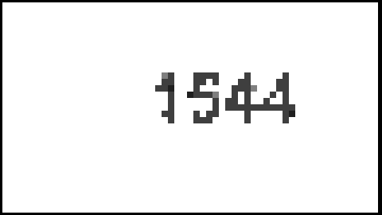
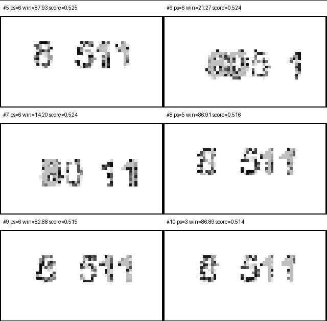
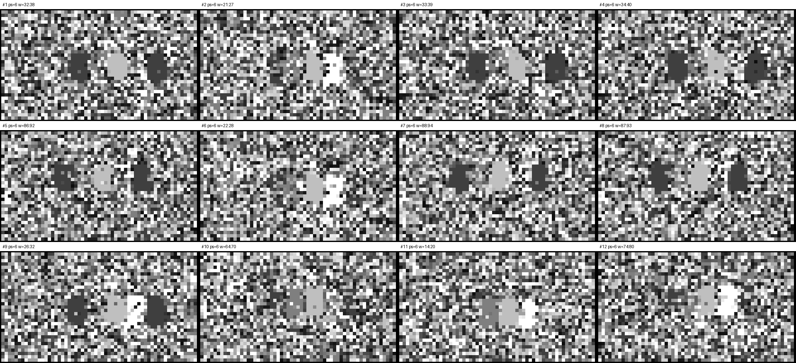
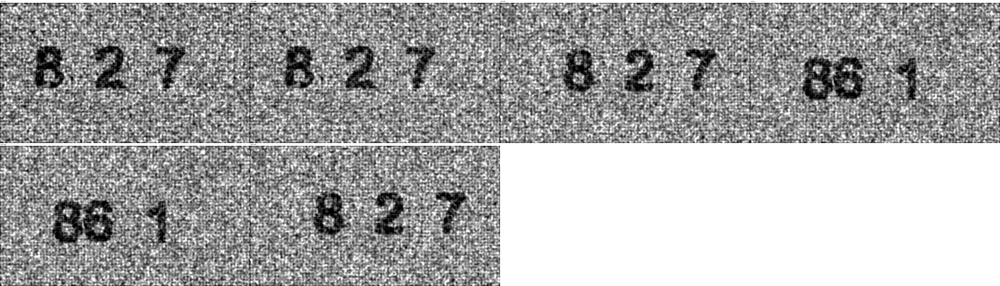
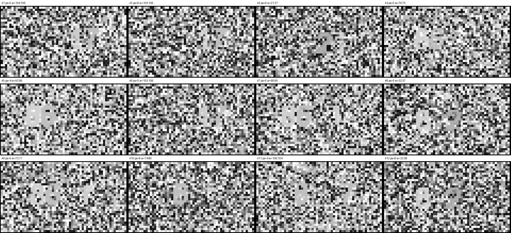
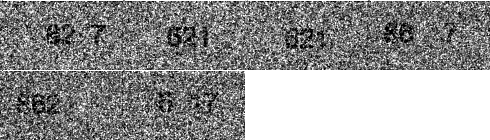

# GOTCHA

**G**liding **O**ptical **T**rick to **C**hallenge **H**umans vs **A**lgorithms

I saw a cool video about a video game noise shader and thought: what if
overlapping random noise masks could hide a secret number, readable only by humans? 
A single frame looks pretty much like static. But when the video plays, your visual 
system groups the motion and the number pops out.

## Version 1:

This version uses a simple concept. Orthogonal noise masks cause each frame 
to look like noise but the motion allows humans to see the message.

### version 1 video:

Direct MP4 link: [assets/version_1.mp4](assets/version_1.mp4)
<video src="https://github.com/user-attachments/assets/a347d553-7749-4d02-b79b-76f2135326a1" controls muted playsinline width="720">
  Your browser does not support embedded video.
</video>

<details>
<summary>Reveal</summary>

**1544**

</details>

I shared it publicly and confidently claimed that biology still has a leg up
on technology. Within hours, someone in the comments cracked it using
block-matching optical flow. I personally dug into this attack vector
and realized that the algorithm only required **two frames** to retrieve
the secret message!

### version 1 attack results:



## Version 2:

Instead of walking away, I spent the next few weeks trying to make it harder
to break. The second version adds one more digit and never shows all digits at once, 
so no single frame pair can recover the full secret message. 
However sweeping across all pairs still lets the bot piece together the whole number.

### version 2 video:

Direct MP4 link: [assets/version_2.mp4](assets/version_2.mp4)
<video src="https://github.com/user-attachments/assets/a6b1617e-8891-4e32-a6f0-8557fbaf0aca" controls muted playsinline width="720">
  Your browser does not support embedded video. Use the direct link above.
</video>

<details>
<summary>Reveal</summary>

**80511**

</details>

### version 2 attack results:



## Version 3:

The third version introduced a different background noise pattern.
While completely conquering the block-flow attack, it really lost
its human readability. So what's the point of fooling an algorithm 
if we as humans also struggle with it?

### version 3 video:

Direct MP4 link: [assets/version_3.mp4](assets/version_3.mp4)
<video src="assets/version_3.mp4" controls muted playsinline width="720">
  Your browser does not support embedded video. Use the direct link above.
</video>

<details>
<summary>Reveal</summary>

**65828**

</details>

### version 3 attack results:



## Version 4:

Starting to get frustrated I tried one more thing. I changed the grain sizes
between the background and text. The mismatch is actually reasonably readable
for a human because the difference in pixel size makes edges easier to perceive.
And the background palette cycling completely defeats the block-matching
optical flow attack!

Happy with the results I wanted to wrap up the project but decided to try one
more idea: a single-frame attack. The variance attack computes each pixel's
deviation from its local mean and smooths the result, revealing the hidden
digits through the grain-size fingerprint alone so no motion analysis needed.
Sure enough, it pulled all the digits out. Again, what's the point of fooling
block-matching optical flow when another algorithm can read the digits from
individual frames?

The video was too large to upload to GitHub but here are the attack results.

### version 4 attack results:

**Block-matching optical flow**


**Variance**


## Version 4.5:

At this point I was pretty dejected and just decided to write everything up.
It was a good try and I did learn a lot so no harm done. Prepping the story
for this README I started uploading videos and images. As mentioned earlier,
the version 4 video was too large so I compressed it using H.264.
You can watch it below.

Direct MP4 link: [assets/version\_4\_compressed.mp4](assets/version_4_compressed.mp4)
<video src="https://github.com/user-attachments/assets/a61ac468-5b0c-465f-9f25-db52ec732934" controls muted playsinline width="720">
  Your browser does not support embedded video. Use the direct link above.
</video>

<details>
<summary>Reveal</summary>

**86217**

</details>

Just to be fair with the results I was presenting I decided to rerun the attacks
on the compressed version of the video. Something interesting happened which I didn't expect.
The algorithms were having a much harder time getting the digits. 
The compression was destroying the subtle grain-size fingerprint that the 
variance attack relies on, while humans could still read the video just fine.

Lowering the video quality makes it harder for algorithms but no harder for
humans. That's exactly the kind of asymmetry this whole project is built on.

### version 4.5 attack results:

**Block-matching optical flow**


**Variance**


## Conclusion

Can this newest version be broken? I'm sure it can. Spending more time
on the algorithm might produce better results. But maybe that's not the point.

No matter how advanced LLMs and AI get, they will fundamentally differ from
humans. Can they simulate human vision to some degree using clever tricks and
algorithms? Of course. But just like humans who can use a car to outrun a
cheetah, it doesn't mean we are all cheetahs now.

Our jagged intelligence will most likely never fully overlap with AI's jagged
intelligence. As long as we can find and probe those gaps we should still be
able to tell ourselves apart. This weird little experiment has taken me down an
interesting technological and philosophical rabbit hole and I enjoyed every
minute of it.

## Tools

| File | What it does |
|------|-------------|
| `generate_baseline.py` | Original generator — two sliding noise fields. Trivially crackable. |
| `generate_defense.py` | Defense generator — tile-based motion palette with phase-sliced reveals. |
| `attack_bench.py` | Run the block-flow attack on a single video file. |
| `attack_pair_sweep.py` | Sweep consecutive frame pairs across a video and rank the best attacks. |
| `attack_variance.py` | Variance-based static-frame attack. Exploits grain-size mismatch without temporal information. |
| `attack_resistance_sweep.py` | Generate a grid of defense settings, attack each, and rank by resistance. Saves videos for the strongest and weakest cases. |

## Try It Yourself

```bash
poetry install
```

Generate a clip with the baseline generator (the one that got cracked):

```bash
poetry run python generate_baseline.py --text HELLO --grain 16 --output hello.mp4
```

Now attack it:

```bash
poetry run python attack_bench.py hello.mp4 --output-dir attack_runs/hello
```

Open `attack_runs/hello/block_flow_angle.png` — the word is right there.

Sweep all frame pairs for a ranked montage:

```bash
poetry run python attack_pair_sweep.py hello.mp4 --output-dir sweep_runs/hello
```

Try the defense generator instead:

```bash
poetry run python generate_defense.py --random-digits --background-grain 8 --text-grain 16 --output defended.mp4
```

Attack that one and compare the results.

<details>
<summary>Flag reference</summary>

### generate\_baseline.py

| Flag | What it does |
|------|-------------|
| `--grain` | Noise block size in pixels (smaller = finer noise) |
| `--duration` | Clip length in seconds |
| `--speed` | How fast the noise slides (pixels per frame) |
| `--font-size` | Text size in pixels |
| `--text-drift` | Total pixels the word oscillates over time |
| `--text-drift-speed` | How fast the word oscillates (cycles per second) |
| `--feather` | Gaussian blur radius on the text mask edge |
| `--font` | Path to a `.ttf` or `.otf` font file |
| `--seed` | Fix the random seed for reproducibility |
| `--width`, `--height` | Output resolution (default 1920x1080) |
| `--fps` | Frame rate (default 30) |

### generate\_defense.py

| Flag | What it does |
|------|-------------|
| `--text` | Text to render (default `VISIBLE`) |
| `--random-digits` | Generate a random 5-digit code internally instead of using `--text` |
| `--output` | Output file path |
| `--width`, `--height` | Output resolution (default 1920x1080) |
| `--fps` | Frame rate (default 30) |
| `--duration` | Clip length in seconds (default 5) |
| `--font-size` | Text size in pixels (default 340) |
| `--font` | Path to a `.ttf` or `.otf` font file |
| `--seed` | Fix the random seed for reproducibility |
| `--gif` | Write GIF output instead of MP4 |
| `--grain` | Base noise block size in pixels (default 3) |
| `--background-grain` | Noise grain for background fields (default 8) |
| `--text-grain` | Noise grain for text fields (default 16) |
| `--feather` | Gaussian blur radius on the text mask edge (default 1.25) |
| `--text-drift` | Maximum whole-text drift in pixels (default 200) |
| `--text-drift-speed` | Drift speed in cycles per second (default 0.16) |
| `--tile-size` | Motion tile size in pixels (default 12) |
| `--palette` | Motion vector palette, e.g. `"-2,0;0,-2;2,0;0,2"` |
| `--text-vector-index` | Base palette index used to seed the text-phase vector cycle (default 1) |
| `--background-vector-index` | Optional fixed palette index for all background tiles |
| `--phase-mode` | `components` (whole digits), `bands` (diagonal slices), or `glyphs` (individual characters) |
| `--phase-count` | Number of reveal groups (default 4) |
| `--active-phases` | How many groups are visible at once (default 3) |
| `--phase-hold` | Frames each phase pattern holds before rotating (default 5) |
| `--schedule-mode` | `randomized` (default), `cycle`, `overlap_cycle`, or `pair_safe_random` |
| `--schedule-span` | How many windows a visible subset persists (default 3) |
| `--pair-safe-max-gap` | Maximum frame gap the pair-safe scheduler protects against (default 6) |
| `--background-cycle-step` | Palette rotation step for background, 0 disables (default 0) |
| `--background-cycle-hold` | Frames between background palette rotations (default 12) |

### attack\_bench.py

| Flag | What it does |
|------|-------------|
| `--downscale` | Scale factor before analysis (default 0.25) |
| `--block-size` | Block size for block matching (default 8) |
| `--search-radius` | Search radius for block matching (default 3) |
| `--pair-step` | Frame gap between the two frames in a pair (default 1) |
| `--max-pairs` | Frame pairs to average (default 1) |
| `--window-size` | Sliding window length in frames (0 = full clip) |
| `--window-stride` | Stride between windows (default 1) |
| `--include-full-window` | Also run full-clip analysis alongside windows |

### attack\_pair\_sweep.py

| Flag | What it does |
|------|-------------|
| `--pair-steps` | Comma-separated pair gaps to sweep (default 1) |
| `--window-size` | Frame window length (0 = pair_step + 1) |
| `--window-stride` | Stride between candidate windows (default 1) |
| `--include-full-window` | Also evaluate the full clip |
| `--top-k` | How many top results to save and montage (default 12) |

### attack\_variance.py

| Flag | What it does |
|------|-------------|
| `--kernel` | Local-mean kernel size for the deviation step (default 3) |
| `--sigma` | Gaussian blur strength for smoothing the deviation field (default 8) |
| `--frame-step` | Keep every Nth frame from video input (default 1) |
| `--max-frames` | Maximum frames to process, 0 means all (default 0) |
| `--top-k` | How many highest-scoring frames to save and montage (default 12) |
| `--montage-cols` | Number of columns in the top-k montage (default 4) |
| `--diagnostic` | Save intermediate stages for the first frame |

### attack\_resistance\_sweep.py

| Flag | What it does |
|------|-------------|
| `--background-grains` | Comma-separated background grain values to sweep |
| `--text-grains` | Comma-separated text grain values to sweep |
| `--tile-sizes` | Comma-separated tile sizes to sweep |
| `--phase-counts` | Comma-separated phase counts to sweep |
| `--active-phases-values` | Comma-separated active phase counts to sweep |
| `--phase-modes` | Comma-separated phase modes to sweep |
| `--schedule-modes` | Comma-separated schedule modes to sweep |
| `--save-top-k` | Save videos for top K hardest and easiest cases (default 3) |

All tools support `--help` for the full flag list.

</details>

## Inspiration

This project was directly inspired by
[this YouTube video](https://www.youtube.com/watch?v=RNhiT-SmR1Q).

## License

[MIT](LICENSE)
